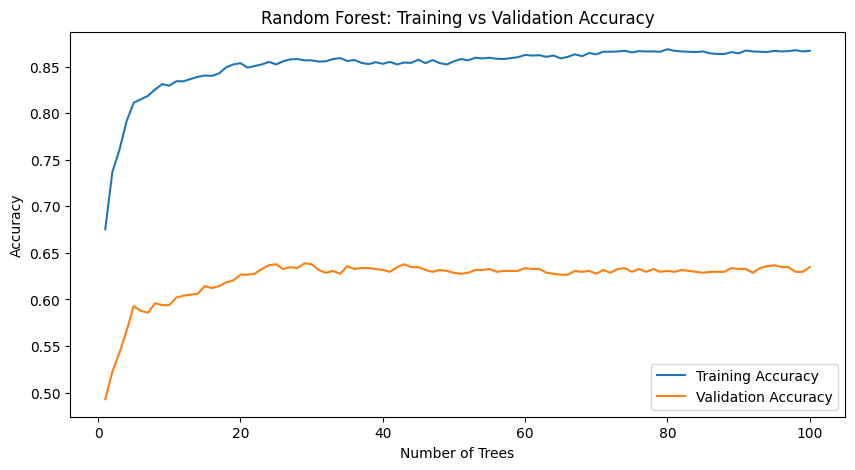
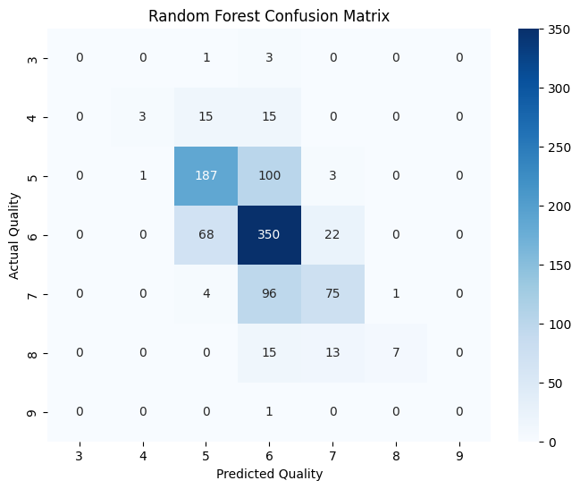
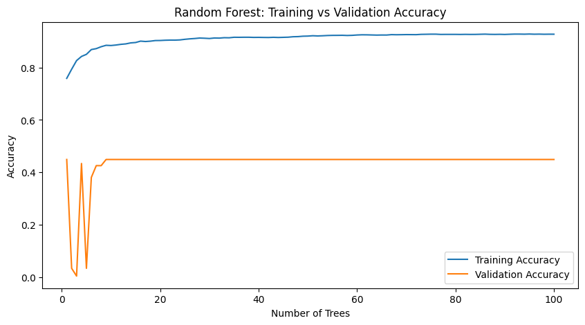
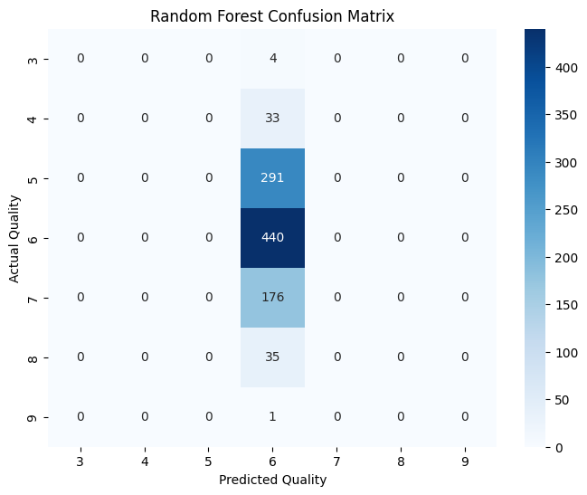
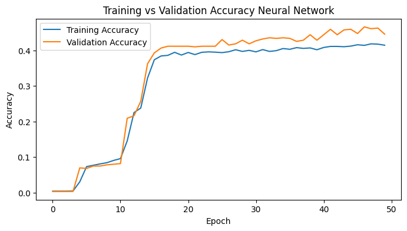
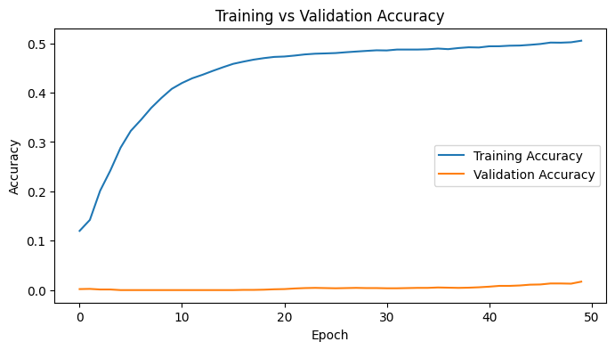
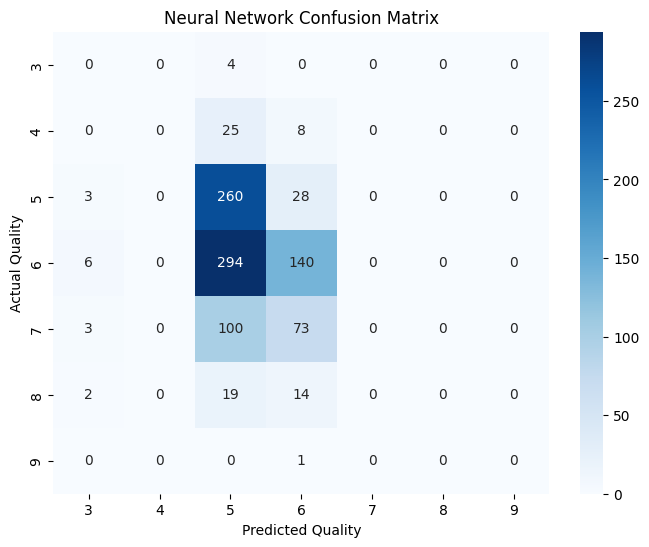

# Wine Quality Grader

This is an AI Project developd for the subject **TC3002B**.

The objective of this project is to predict wine quality based on physicochemical properties using machine learning techniques.

---

# Dataset

The dataset used in this project is the **Wine Quality Dataset** from the UCI Machine Learning Repository:
https://archive.ics.uci.edu/dataset/186/wine+quality

Only the **white wine dataset** was selected due to its larger number of instances.

---

# Project Structure

### 🔹 Dataset

Contains the original dataset and the generated train/test splits.

* **test/**
    * `test.data` → No preprocessed test dataset
* **train/**
    * `train.data` → Preprocessed and augmented training dataset
* **winequality-white.csv** → Original dataset

---

### 🔹 Preprocessing

Folder where preoprocessing is made:
* `winequiality_tuning_dataset.ipynb`
    1. Loads csv.
    2. Separates attributes and labels.
    3. Splits dataset.
    4. Scale the attributes.
    5. Augmentates data.
    6. Save datasets in respective folders on `Dataset`.

###  🔹 Models


## 📌 Random Forest Model

This model serves as the baseline model of the project, as Random Forest achieved the highest F1-score among the models reported in the literature reviewed for this dataset.

The model consists of an ensemble of decision trees. Each tree is built by recursively splitting the data using the **Gini Impurity** criterion in order to create increasingly pure nodes. The final prediction is obtained through a majority vote among all trees in the forest.

The model architecture is defined in `models/random_forest_model.py` and imported by the corresponding execution notebooks.

### Current Configuration

- Number of trees: 100
- Maximum depth: 10
- Random state: 42

---

## 📌 Neural Network Model

This model is implemented using **TensorFlow** and **Keras**.

The network consists of:

- Input layer with 11 features
- Hidden layer with 16 neurons and ReLU activation
- Output layer with Softmax activation to predict the wine quality class

Label encoding is applied to transform wine quality scores into sequential class identifiers required by the Softmax classifier.

A learning rate of `0.0001` is used in the Adam optimizer to promote stable convergence and reduce oscillations during gradient descent.

The model architecture is defined in `models/neural_network_model.py` and imported by the corresponding execution notebooks.

#### Current Architecture

```python
model = tf.keras.Sequential([
    tf.keras.layers.Dense(
        16,
        activation='relu',
        input_shape=(11,)
    ),

    tf.keras.layers.Dense(
        num_classes,
        activation='softmax'
    )
])
```

## 📌 Future Model Improvements

The following improvements may be explored in future iterations of the project:

- Implement additional models reported in the literature:
  - Decision Tree
  - XGBoost
- Perform systematic hyperparameter tuning for all models.
- Experiment with deeper neural network architectures.
- Evaluate different learning rates, batch sizes, and regularization techniques.
- Investigate class imbalance handling strategies and their impact on model generalization.

---

# Evaluation Metrics

The performance of the models will be evaluated using the following metrics:

* **Accuracy**  
  Measures the proportion of correctly classified instances.

For the Neural Network model, training and validation accuracy curves are also analyzed to study learning behavior and model generalization.

For the Random Forest model, training and validation accuracy are analyzed as a function of the number of trees in the forest.

* **Precision**  
  Measures how reliable the predictions for each class are.

* **Recall**  
  Measures how many relevant instances were correctly identified.

* **F1-Score**  
  Measures the balance between Precision and Recall.

* **Confusion Matrix**
  Visual representation of the classification among all classes.

### Analysis of results

#### Baseline - Random Forest:
For original dataset

* Accuracy : 0.6347
* Precision: 0.6486
* Recall   : 0.6347
* F1 Score : 0.6146




The Random Forest model achieved the best overall performance. Although there is evidence of overfitting, it still produced the highest F1-score and generalized better than the Neural Network.

For tuned dataset
* Accuracy : 0.4490
* Precision: 0.2016
* Recall   : 0.4490
* F1 Score : 0.2782




Applying SMOTE and balancing techniques reduced the model performance. The model became biased toward to only one class, resulting in a significant decrease in F1-score.

#### Basic Neural Network:
For original dataset

* Accuracy : 0.4357
* Precision: 0.3635
* Recall   : 0.4357
* F1 Score : 0.3652




The Neural Network showed lower performance than Random Forest but maintained similar training and testing results, indicating stable generalization.

For tuned dataset
* Accuracy : 0.4082
* Precision: 0.3481
* Recall   : 0.4082
* F1 Score : 0.3341




Dataset balancing did not improve performance. While the model predicted more than one class, the overall predictive capability remained limited.

---
#### Overall comparison

Among all evaluated configurations, the Random Forest trained on the original dataset produced the best results, achieving the highest Accuracy, Precision, Recall, and F1-score.

The experiments also revealed that dataset balancing through SMOTE did not improve model performance. In both Random Forest and Neural Network models, the balanced dataset resulted in lower testing metrics, suggesting that synthetic samples introduced noise rather than useful information.

These findings are consistent with the literature, where tree-based models frequently outperform neural networks on small-to-medium sized tabular datasets.