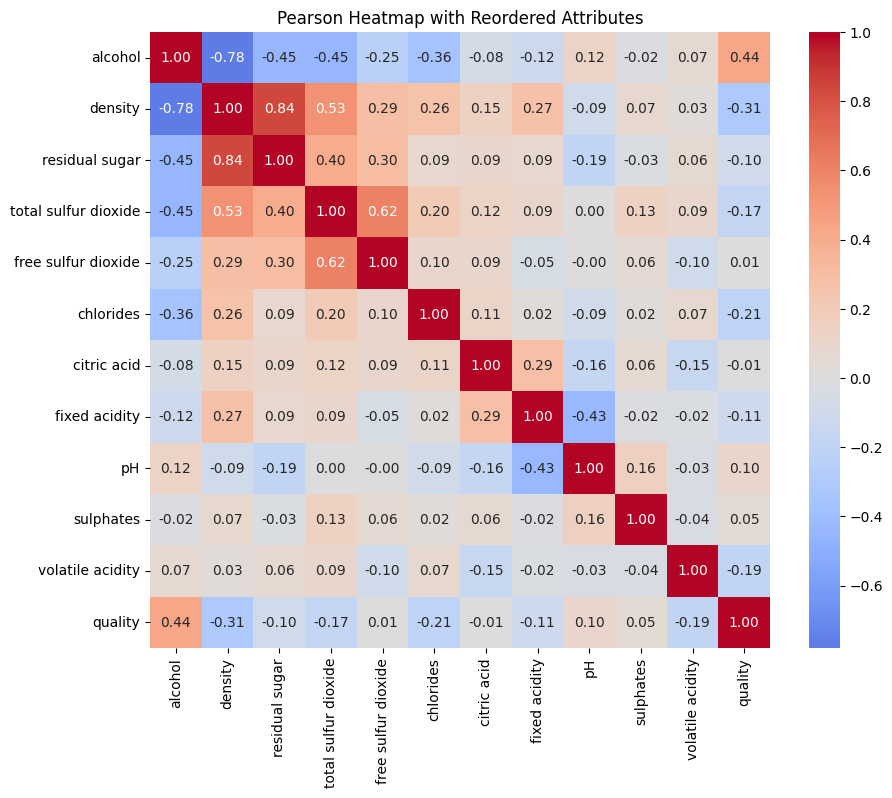
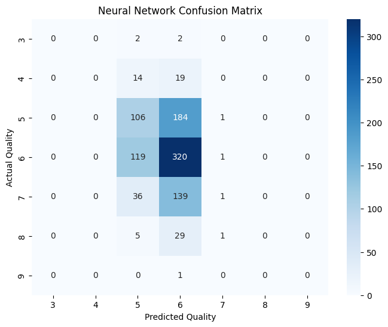
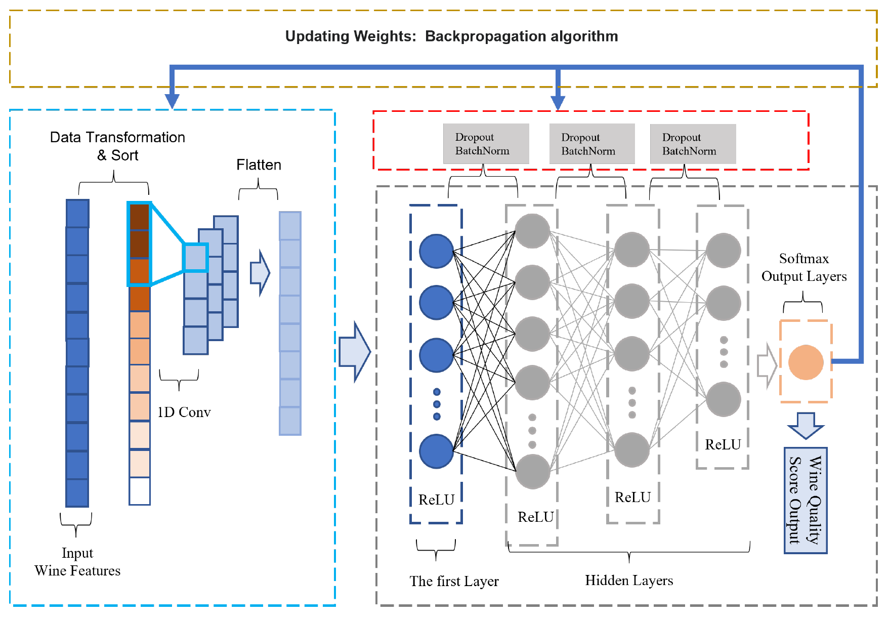

# Wine Quality Grader

This is an AI Project developd for the subject TC3002B.

The objective of this project is to predict wine quality based on physicochemical properties using machine learning techniques.

---

## 1. Dataset

The dataset used in this project is the **Wine Quality Dataset** from the UCI Machine Learning Repository [1]:
https://archive.ics.uci.edu/dataset/186/wine+quality

Only the **white wine dataset** was selected due to its larger number of instances.

This dataset contains:

- **4,898 samples**
- **11 physicochemical input attributes**
- **1 target variable:** `quality`
- **No missing values**
- Quality scores in an ordered scale from **0 to 10**

The selected input attributes are:

| Attribute | Description |
|---|---|
| `fixed acidity` | Non-volatile acids in the wine |
| `volatile acidity` | Acetic acid content |
| `citric acid` | Citric acid content |
| `residual sugar` | Sugar remaining after fermentation |
| `chlorides` | Salt content |
| `free sulfur dioxide` | Free SO₂ content |
| `total sulfur dioxide` | Total SO₂ content |
| `density` | Wine density |
| `pH` | Acidity/basicity level |
| `sulphates` | Sulphate content |
| `alcohol` | Alcohol percentage |

The target variable is:

| Target | Description |
|---|---|
| `quality` | Sensory quality score assigned by wine experts |

A relevant fact in here is that the dataset is imbalanced so that high quality wines are less frequent.

---

## 2. Project Structure

```text
AI_Wine_Quality/
│
├── Dataset/
│   ├── winequality-white.csv
│   ├── train/
│   │   └── preprocessed_train.csv
│   └── test/
│       └── preprocessed_test.csv
│
├── Preprocessing/
|   ├── winequiality_tuning_dataset.ipynb
│   └── winequiality_preprocessing.ipynb
│
├── Excecution/
|   ├── Excecution original dataset/
|   |   └── random_forest_baseline.ipynb
|   |   └── neural_network_execution.ipynb
|   └── Excecution preprocessed dataset/
|       └── random_forest_baseline.ipynb
|       └── neural_network_execution.ipynb
|       └── 1D-CNN_execution.ipynb
│
├── models/
│   ├── neural_network_model.py
│   ├── oneD_CNN_model_pooling_tuned.py
│   ├── oneD_CNN_model_pooling.py
│   ├── oneD_CNN_model.py
│   ├── random_forest_model.py
│   ├── 1D_CNN_checkpoints/
|   |   └── training_log.csv
|   |   └── best_1D_CNN_model.keras
│   └── 1D_CNN_periodic_checkpoints/
|       └── training_log.csv
│
├── images/
│   ├── random_forest_performance/
│   ├── neural_network_performance/
│   └── 1D_CNN_performance/
│
└── README.md
```

---

## 3. Dataset Generation and Preprocessing

### 3.1 Dataset selection

No synthetic samples are used in the final pipeline. Earlier experiments with balancing techniques such as SMOTE were tested, but they reduced model performance, so the final implementation keeps the original class distribution.

### 3.2 Data cleaning and verification

The preprocessing notebook performs the following verification steps:

1. Load the original CSV file using `;` as separator.
2. Check for missing values.
3. Check for duplicated rows.
4. Analyze the class distribution of the `quality` variable.
5. Separate attributes `X` and label `y`.

### 3.3 Pearson correlation analysis and feature ordering

The 1D-CNN paper argues that the order of physicochemical features matters because convolutional layers can capture relationships between neighboring attributes [3]. Based on this idea, Pearson correlation was used to reorder the wine attributes before feeding them into the 1D-CNN.

The implemented preprocessing calculates the Pearson correlation matrix and creates an attribute order that places highly related features close to each other. This allows the 1D convolutional layer to process correlated attributes in nearby positions.



### 3.4 Train-test split

The dataset was divided into:

- **80% training set**
- **20% test set**

Final split:

| Set | Samples |
|---|---:|
| Training set | 3,918 |
| Test set | 980 |

### 3.5 Scaling

The physicochemical attributes were scaled using **Z-score standardization**:

```text
z = (x - μ) / σ
```

The scaler was fitted only on the training set and then applied to the test set. This avoids data leakage because information from the test set is not used during preprocessing. This was implemented just as in 1DCNN paper [3].

### 3.6 Saved preprocessed files

The final preprocessed datasets are saved as:

```text
Dataset/train/preprocessed_train.csv
Dataset/test/preprocessed_test.csv
```

Each file contains the scaled attributes plus the original `quality` label.

---

## 4. Model Implementation

Two main model families were implemented:

1. **Random Forest**, used as the classical machine learning baseline.
2. **1D-CNN**, used as the neural network model inspired by the reviewed deep learning paper [3].

---

## 5. Random Forest Baseline

Random Forest was selected as the baseline because a reviewed paper reported it as the best-performing classical model for wine quality prediction, reaching **66.8% accuracy** and **0.651 F1-score** on the test set [2].

The model is implemented using **Scikit-learn**.

### Random Forest configuration

```python
RandomForestClassifier(
    n_estimators=100,
    max_depth=10,
    random_state=42
)
```

### Random Forest results

| Set | Accuracy | Precision | Recall | F1-score |
|---|---:|---:|---:|---:|
| Training | 0.8669 | 0.8789 | 0.8669 | 0.8641 |
| Test | 0.6347 | 0.6486 | 0.6347 | 0.6146 |


---

## 6. Initial Neural Network Baseline

Before implementing the 1D-CNN, a basic neural network was tested as an initial deep learning baseline.

### Basic neural network architecture

```python
model = tf.keras.Sequential([
    tf.keras.layers.Dense(16, activation="relu", input_shape=(11,)),
    tf.keras.layers.Dense(num_classes, activation="softmax")
])
```

### Best basic neural network result

| Model | Test F1-score |
|---|---:|
| Basic Neural Network | 0.36 |




### Observations

The first neural network performed significantly worse than Random Forest.

This suggests that a simple dense architecture is not enough to capture the relationships between the wine attributes, so a more advanced architecture was explored.

---

## 7. 1D-CNN Model

The 1D-CNN model was selected based on the paper **Prediction of Red Wine Quality Using One-Dimensional Convolutional Neural Networks** [3].

The paper proposes using a 1D-CNN because wine physicochemical properties are not independent; some features may interact with each other. By ordering correlated features close together, a 1D convolution can capture local relationships between neighboring attributes.

The paper also reports the use of:

- Pearson correlation analysis
- Feature scaling
- 1D convolution
- Dense layers with ReLU
- Dropout
- Batch Normalization
- Softmax output
- Cross-entropy loss



The paper reports a 1D-CNN result of **0.858 F1-score**, but this value is reported as a mean over ten classification tasks and is based on the red wine problem, so it is not directly comparable to this project's white wine [3].

---

## 8. Final 1D-CNN Architecture

As the paper does not mention indeed the values for each dense layer and other hyperparameters of interest, the following architecture was implemented by experimenting with metrics and callbacks.
The final refined 1D-CNN keeps the general idea from the paper but includes additional refinements to improve generalization.

### Encoder

```text
Input(11, 1)
↓
Conv1D
↓
SpatialDropout1D *
↓
BatchNormalization
↓
MaxPooling1D *
↓
GlobalAveragePooling1D *
```

### Decoder

```text
Dense(32, ReLU)
↓
BatchNormalization
↓
Dropout
↓
Dense(16, ReLU)
↓
BatchNormalization
↓
Dropout
↓
Dense(8, ReLU)
↓
BatchNormalization
↓
Dropout
↓
Dense(4, ReLU)
↓
Softmax
```

### Final hyperparameters

| Hyperparameter | Value |
|---|---:|
| Optimizer | Adam |
| Learning rate | 0.0005 |
| Loss function | Sparse Categorical Crossentropy |
| Batch size | 64 |
| Dropout rate | 0.35 |
| Conv1D filters | 32 |
| Kernel size | 5 |
| L2 regularization | 0.001 |
| Spatial dropout | 0.15 |
| Epochs | 100 |
| Callback monitor | Validation metric / best checkpoint |

### Callbacks used

The training process uses callbacks to improve stability and save the best version of the model:

- `ModelCheckpoint`: saves the best model during training.
- `EarlyStopping`: stops training when validation performance stops improving.
- `CSVLogger`: saves the training history.
- `SaveModelEveryNEpochs`: saves additional versions of the model every selected number of epochs.

---

## 9. Evaluation Metrics

The models were evaluated using:

| Metric | Purpose |
|---|---|
| Accuracy | Measures the proportion of correctly classified predictions |
| Precision | Measures how reliable the predictions for each class are |
| Recall | Measures how many relevant instances were correctly identified |
| F1-score | Measures the balance between Precision and Recall |
| Confusion Matrix | Visual representation of the classification among all classes |

The main comparison metric is **F1-score**, because the wine quality classes are imbalanced. F1-score is more informative than accuracy when some classes appear much more frequently than others.

A **generalization gap** was also calculated:

```text
Generalization gap = Training F1-score - Test F1-score
```

A smaller gap indicates less overfitting.

---

## 10. Model Refinement

| Version | Main change | Train F1 | Test F1 | Gap |
|---|---|---:|---:|---:|
| **Basic CNN** | Initial neural network baseline | — | 0.3600 | — |
| First 1D-CNN | Architecture based paper [3] | 0.6055 | 0.5382 | **0.0673** |
| 1D-CNN + callbacks | Added checkpointing and early stopping | 0.6506 | 0.5508 | 0.0998 |
| 1D-CNN + pooling + callbacks | Added pooling to reduce feature dimensionality | 0.7652 | 0.5790 | 0.1862 |
| 1D-CNN + tuned hyperparameters + callbacks | Updated learning rate, dropout, batch size, filters and kernel | 0.6963 | 0.5596 | 0.1367 |
| 1D-CNN + pooling + tuned hyperparameters + callbacks | Pooling and updated hyperparameters | 0.8600 | 0.5758 | 0.2842 |
| **Reduced 1D-CNN + pooling + tuned hyperparameters + callbacks** | Reduced dense decoder capacity | 0.8720 | **0.6295** | 0.2425 |

### What changed during refinement?

The first neural network models obtained relatively low F1-scores.

After implementing the 1D-CNN architecture, the results improved noticeably. Additional changes such as callbacks, pooling layers and hyperparameter tuning produced further improvements.

The best results were obtained after reducing the size of the dense decoder while keeping the convolutional structure.

---

## 11. Final Models

### Best Performance Model

This model achieved the highest test F1-score.

| Model | Train Accuracy | Train F1 | Test Accuracy | Test Precision | Test Recall | Test F1 | Gap |
|---|---:|---:|---:|---:|---:|---:|---:|
| Reduced 1D-CNN + Pooling + Callbacks | 0.8729 | 0.8720 | 0.6337 | 0.6298 | 0.6337 | **0.6295** | 0.2425 |

### Best Generalization Model

This model had the smallest difference between training and test F1-score.

| Model | Train Accuracy | Train F1 | Test Accuracy | Test Precision | Test Recall | Test F1 | Gap |
|---|---:|---:|---:|---:|---:|---:|---:|
| First 1D-CNN | 0.6276 | 0.6055 | 0.5602 | 0.5257 | 0.5602 | 0.5382 | **0.0673** |


### Final model decision

For final performance, the selected model is the **Reduced 1D-CNN + pooling + tuned hyperparameters + callbacks** because it achieved the highest test F1-score and slightly surpassed the implemented Random Forest baseline.

For model analysis, the First 1D-CNN is kept as the best generalization reference because it showed the lowest overfitting gap.

This distinction is important because the goal is not only to maximize F1-score, but also to understand whether the model generalizes correctly.

---

## 12. Random Forest vs 1D-CNN

| Model | Type | Test Accuracy | Test Precision | Test Recall | Test F1-score | Notes |
|---|---|---:|---:|---:|---:|---|
| Random Forest | Classical ML baseline | 0.6347 | **0.6486** | 0.6347 | 0.6146 | Strong baseline; still overfits |
| Reduced 1D-CNN + pooling + tuned hyperparameters + callbacks | Neural Network | 0.6337 | 0.6298 | 0.6337 | **0.6295** | Best neural model; highest test F1 |

---

## 13. Comparison with papers

| Source | Model | Reported result | Notes |
|---|---|---:|---|
| Zeng et al. [2] | Random Forest | Accuracy: 0.668, F1: 0.651 | Classical ML paper using train/validation/test split |
| Di & Yang [3] | 1D-CNN | Accuracy: 0.832, F1: 0.858 | Reported as mean metrics over ten classification tasks; red wine context |
| This project | Random Forest | Test F1: 0.6146 | White wine dataset, local implementation |
| This project | Reduced 1D-CNN + pooling + tuned hyperparameters + callbacks | Test F1: 0.6295 | Best neural network result |

---

## 14. Corrections and Improvements Made

The following corrections were made during model refinement:

- Replaced the initial basic neural network with a 1D-CNN architecture.
- Reordered attributes using Pearson correlation before training the 1D-CNN.
- Added callbacks to save the best model and prevent unnecessary training.
- Added pooling to reduce dimensionality before the dense layers.
- Tuned learning rate, dropout rate, batch size, filter count, and kernel size.
- Reduced the dense decoder to control model capacity.
- Added L2 regularization and spatial dropout.

---

## 15. Limitations

The final neural network improved test F1-score, but overfitting remains visible. This is expected to some degree because:

- The dataset is relatively small for deep learning.
- The classes are imbalanced.
- Wine quality labels are ordinal and subjective.
- Neighboring quality classes can be difficult to separate exactly.
- Environmental attributes are not measured and taken into account (e.g. temperature & light) for model training.

---

## 16. Conclusion

Random Forest provided a strong baseline and achieved competitive results from the beginning. The first neural network models performed poorly, but after introducing a 1D-CNN architecture, feature ordering, pooling layers, callbacks and hyperparameter tuning, the performance improved considerably.

The final 1D-CNN achieved:

Test Accuracy: 0.6337

Test F1-score: 0.6295

Although the improvement over Random Forest is small, the experiments show how architectural decisions and preprocessing techniques can impact model performance.

The project also highlights an important lesson: achieving the highest score is not always the only objective. A model with better generalization may sometimes be preferable to a model with a slightly higher F1-score but stronger overfitting.

---

## References

[1] Cortez, P., Cerdeira, A., Almeida, F., Matos, T., & Reis, J. (2009). *Wine Quality* [Dataset]. UCI Machine Learning Repository. https://doi.org/10.24432/C56S3T

[2] Zeng, C., Fang, J., Yang, Q., Xiang, C., Zhao, Z., & Lei, Y. (2024). *Wine quality grade data analysis and prediction based on multiple machine learning algorithms*. Proceedings of the 6th International Conference on Computing and Data Science. https://doi.org/10.54254/2755-2721/65/20240509

[3] Di, S., & Yang, Y. (2023). *Prediction of Red Wine Quality Using One-Dimensional Convolutional Neural Networks*. arXiv:2208.14008. https://arxiv.org/abs/2208.14008